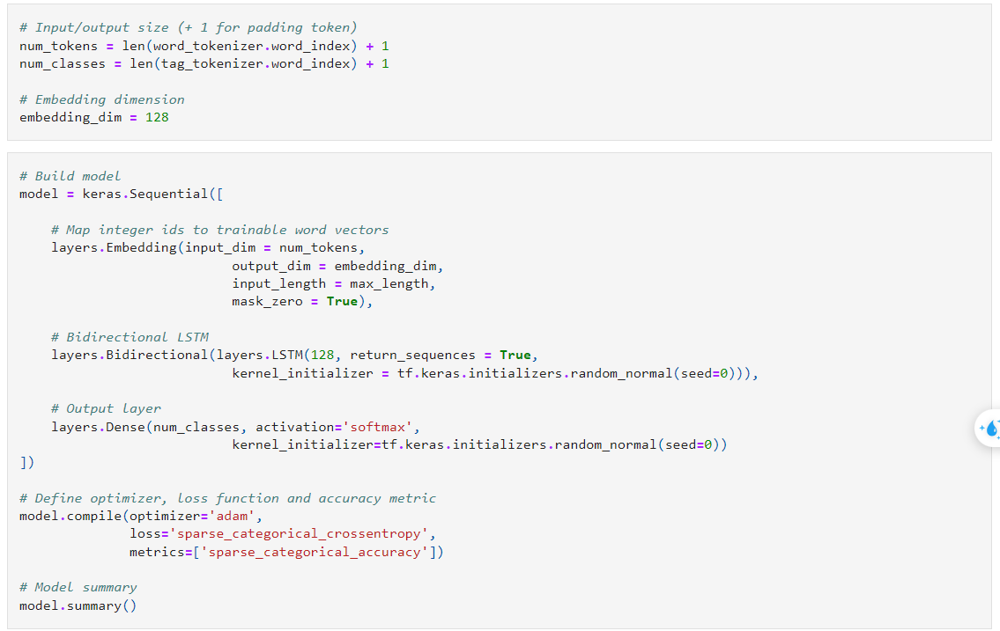
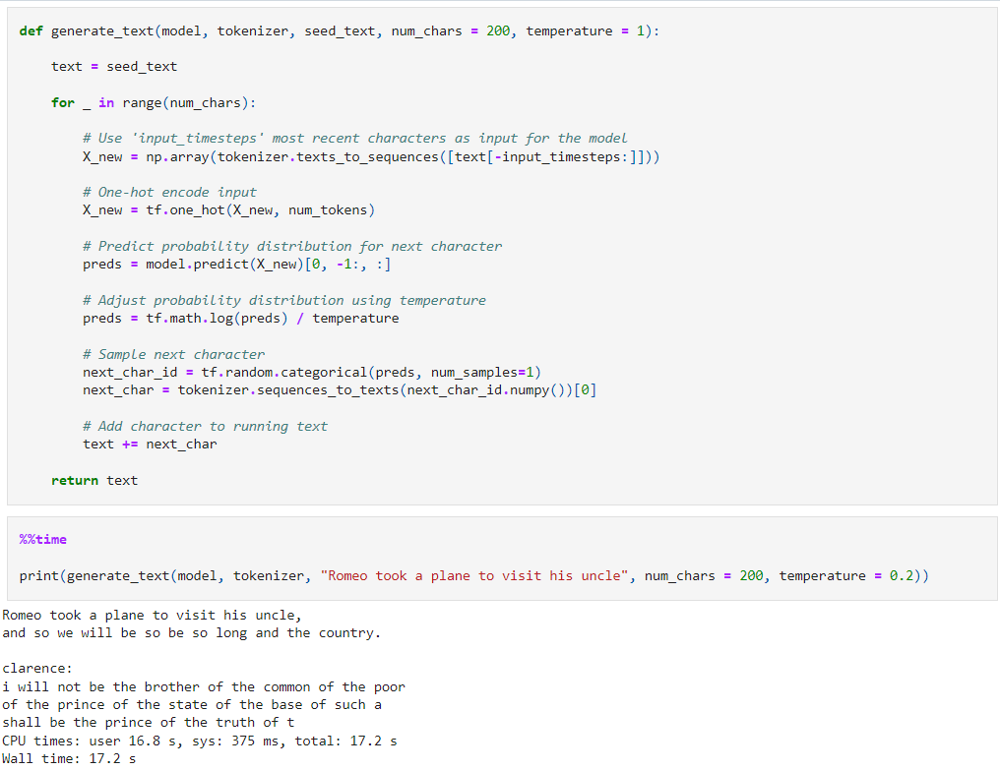
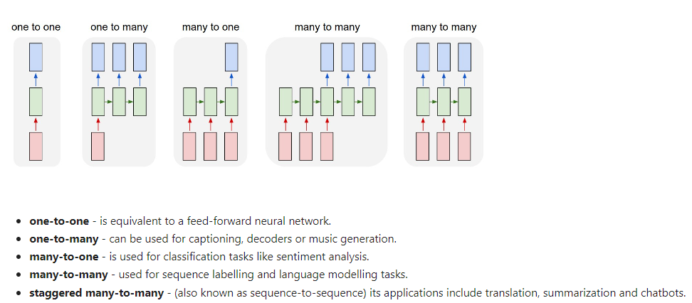

# Tutorial NLP basic

1. Tokenization
2. Preprocessing
3. Bag of Words and Similarity
4. TF-IDF and Document Search
5. Naive Bayes Text Classification
6. LDA Topic Modelling
7. Word Embeddings
8. Recurrent Neural Networks (RNNs) and Language Modelling
9. Machine Translation and Attention
10. Transformers

### Padding:
Padding is a way of making all input sequences the same length, by filling shorter sequences with 0's and truncating longer sequences. Although is isn't necessarily required for RNNs, it usually speeds up training because it is easier to batch training examples together.

### Model:

### Inference:

